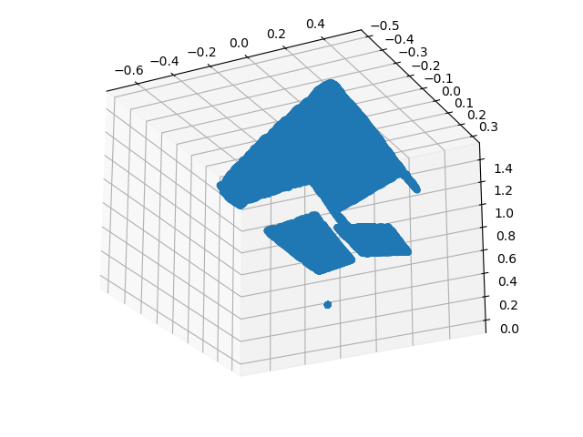

# Realsense Depth Camera Robot Raconteur Driver

The `realsense-robotraconteur-driver` package provides a Robot Raconteur driver for Intel RealSense cameras.
The driver is based on the Python package [pyrealsense2](https://pypi.org/project/pyrealsense2). The driver
provides two services, both in the same node:

* `Multi_Cam_Service`:
RGB Image and Depth Image
([com.robotraconteur.imaging.MultiCamera](https://github.com/robotraconteur/robotraconteur_standard_robdef/blob/master/docs/group1/com.robotraconteur.imaging.md#object-multicamera))
* `PC_Service`
Point Cloud Sensor
([com.robotraconteur.pointcloud.sensor.PointCloudSensor](https://github.com/robotraconteur/robotraconteur_standard_robdef/blob/master/docs/group1/com.robotraconteur.pointcloud.sensor.md#object-pointcloudsensor))

The services use the standard service types for multi-camera devices and point cloud sensors.

This driver has been tested with the Intel Realsense D415 sensor.

## Connection Info

The default connection information is as follows. These details may be changed using `--robotraconteur-*` command
line options when starting the service. Also see the
[Robot Raconteur Service Browser](https://github.com/robotraconteur/RobotRaconteur_ServiceBrowser) to detect
services on the network.

* Multi-Camera Service
  * URL: `rr+tcp://localhost:25415?service=Multi_Cam_Service`
  * Device Name: `realsense_camera` or device name in the configuration file
  * Node Name: `RS_Node`
  * Service Name: `Multi_Cam_Service`
  * Root Object Type:
    * `com.robotraconteur.imaging.MultiCamera`
* Point Cloud Sensor Service
  * URL: `rr+tcp://localhost:25415?service=PC_Service`
  * Device Name: `point_cloud` or device name in the configuration file
  * Node Name: `RS_Node`
  * Service Name: `PC_Service`
  * Root Object Type:
    * `com.robotraconteur.pointcloud.sensor.PointCloudSensor`

## Installation

Install using Python pip. Python 3.12 is not currently supported for `pyrealsense2` so use Python 3.11 on Windows.

```
python -m pip install realsense-robotraconteur-driver
```

On Linux use `python3` instead of `python`. On Ubuntu the `python3-pip` apt package must be installed
to use python pip.

See the Docker section for installation instructions using docker.

## Usage

Example usage:

```
python -m realsense_robotraconteur_driver --realsense-info-file=config/realsense_default_config.yml
```

On Ubuntu, use `python3` instead of `python`

See Docker instructions below.

## Command Line Options

The following command line arguments are available:

- `--realsense-info-file=` - The info file for the realsense device
- `--rgb-resolution` - The resolution of the color image, up to 1920x1080 (default 640x480). Pass as a list, for example `--rgb-resolution 1920 1080`
- `--depth-resolution` - The resolution of the depth image, up to up to 1280x720 (default 640x480). Pass as a list, for example `--depth-resolution 1280 720`
- `--fps=` - Frames per second, default 60

All Robot Raconteur node setup command line options are supported. See [Robot Raconteur Node Command Line Options](https://github.com/robotraconteur/robotraconteur/wiki/Command-Line-Options)

Note: The exception "RuntimeError: Couldn't resolve requests" is typically caused by the device being plugged into a USB 2.0 port.

## Docker Usage

```
sudo docker run --rm --net=host --privileged -v /var/run/robotraconteur:/var/run/robotraconteur -v /var/lib/robotraconteur:/var/lib/robotraconteur wasontech/realsense-robotraconteur-driver --realsense-info-file=/config/realsense_default_config.yml
```

It may be necessary to mount a docker "volume" to access configuration yml files that are not included in the docker image.
See the docker documentation for instructions on mounting a local directory as a volume so it can be accessed inside the docker.

## Examples

* RGB Image View
`python realsense_client_image.py --type=rgb`
* Depth Image View
`python realsense_client_image.py --type=depth`
* Pointcloud View
`python realsense_client_pointcloud.py`


## License

License: Apache 2.0

## Acknowledgment

This work was supported in part by the Advanced Robotics for Manufacturing ("ARM") Institute under Agreement Number W911NF-17-3-0004 sponsored by the Office of the Secretary of Defense. The views and conclusions contained in this document are those of the authors and should not be interpreted as representing the official policies, either expressed or implied, of either ARM or the Office of the Secretary of Defense of the U.S. Government. The U.S. Government is authorized to reproduce and distribute reprints for Government purposes, notwithstanding any copyright notation herein.

This work was supported in part by the New York State Empire State Development Division of Science, Technology and Innovation (NYSTAR) under contract C160142.


